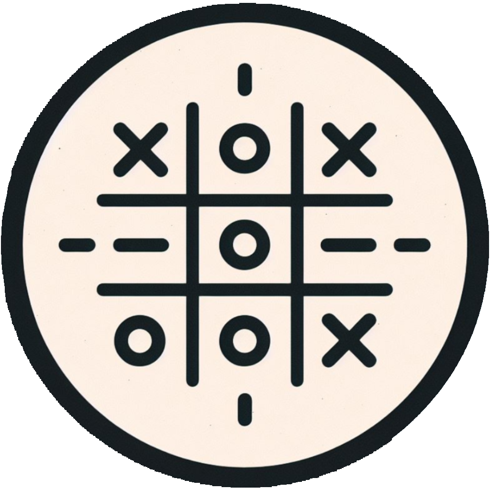
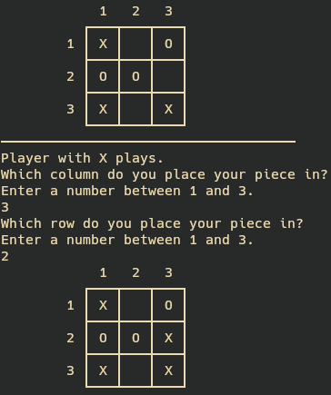
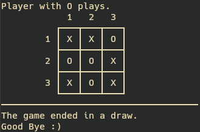

<!-- Improved compatibility of back to top link: See: https://github.com/othneildrew/Best-README-Template/pull/73 -->
<a name="readme-top"></a>
<!--
*** Thanks for checking out the Best-README-Template. If you have a suggestion
*** that would make this better, please fork the repo and create a pull request
*** or simply open an issue with the tag "enhancement".
*** Don't forget to give the project a star!
*** Thanks again! Now go create something AMAZING! :D
-->


<!-- PROJECT SHIELDS -->
<!--
*** I'm using markdown "reference style" links for readability.
*** Reference links are enclosed in brackets [ ] instead of parentheses ( ).
*** See the bottom of this document for the declaration of the reference variables
*** for contributors-url, forks-url, etc. This is an optional, concise syntax you may use.
*** https://www.markdownguide.org/basic-syntax/#reference-style-links
-->
[![Contributors][contributors-shield]][contributors-url]
[![Forks][forks-shield]][forks-url]
[![Stargazers][stars-shield]][stars-url]
[![Issues][issues-shield]][issues-url]
[![MIT License][license-shield]][license-url]
[![LinkedIn][linkedin-shield]][linkedin-url]


<!-- PROJECT LOGO -->
<br />
<div align="center">
  <a href="https://github.com/Fran-cio/ticTacToe">
    
  </a>

<h3 align="center">Tic Tac Toe</h3>

  <p align="center">
    "Tic Tac Toe" is a classic game for one or two players.
    <br />
    <a href="https://github.com/Fran-cio/ticTacToe"><strong>Explore the docs »</strong></a>
    <br />
    <br />
    <a href="https://github.com/Fran-cio/ticTacToe">View Demo</a>
    ·
    <a href="https://github.com/Fran-cio/ticTacToe/issues">Report Bug</a>
    ·
    <a href="https://github.com/Fran-cio/ticTacToe/issues">Request Feature</a>
  </p>
</div>


<!-- TABLE OF CONTENTS -->
<details>
  <summary>Table of Contents</summary>
  <ol>
    <li>
      <a href="#about-the-project">About The Project</a>
      <ul>
        <li><a href="#built-with">Built With</a></li>
      </ul>
    </li>
    <li>
      <a href="#getting-started">Getting Started</a>
      <ul>
        <li><a href="#installation">Installation</a></li>
        <li><a href="#uninstallation">Uninstallation</a></li>
      </ul>
    </li>
    <li><a href="#usage">Usage</a></li>
    <li><a href="#contributing">Contributing</a></li>
    <li><a href="#license">License</a></li>
    <li><a href="#contact">Contact</a></li>
    <li><a href="#acknowledgments">Acknowledgments</a></li>
  </ol>
</details>


<!-- ABOUT THE PROJECT -->
## About The Project

![Product Name Screen Shot][product-screenshot]
<br>
A Tic Tac Toe game is designed for Lesson 16 of the Haskell Course.
<p align="right">(<a href="#readme-top">back to top</a>)</p>

### Built With

* ![Linux][Linux]
* [![Haskell][Haskell]][Haskell-url]
* [![Neovim][Neovim]][Neovim-url]

<p align="right">(<a href="#readme-top">back to top</a>)</p>


<!-- GETTING STARTED -->
## Getting Started
### Prerequisites
Access the installation instructions for the following dependencies.
* [Cabal 3.0](https://www.haskell.org/cabal/) 
* [Haskell 2010](https://www.haskell.org/onlinereport/haskell2010/)
### Installation

1. Clone the repo
   ```sh
   git clone https://github.com/Fran-cio/ticTacToe.git
   ```
2. Make the project 
   ```sh
   cabal run
    ```
<p align="right">(<a href="#readme-top">back to top</a>)</p>


<!-- USAGE EXAMPLES -->
## Usage
Once the game starts, it will prompt you to enter a number for either 1 or 2 players. If you choose to play alone, you'll be up against an AI.



From there, the player(s) will be asked to select the column and then the row to place the piece.



The game ends when a line of 3 pieces of the same type is formed. If all cells are occupied and there's no winner, the game ends in a draw.
<p align="right">(<a href="#readme-top">back to top</a>)</p>


<!-- CONTRIBUTING -->
## Contributing

Contributions are what make the open source community such an amazing place to learn, inspire, and create. Any contributions you make are **greatly appreciated**.

If you have a suggestion that would make this better, please fork the repo and create a pull request. You can also simply open an issue with the tag "enhancement".
Don't forget to give the project a star! Thanks again!

1. Fork the Project
2. Create your Feature Branch (`git checkout -b feature/AmazingFeature`)
3. Commit your Changes (`git commit -m 'Add some AmazingFeature'`)
4. Push to the Branch (`git push origin feature/AmazingFeature`)
5. Open a Pull Request

<p align="right">(<a href="#readme-top">back to top</a>)</p>


<!-- LICENSE -->
## License

Distributed under the Beerware License🍻. See `LICENSE.txt` for more information.

<p align="right">(<a href="#readme-top">back to top</a>)</p>


<!-- CONTACT -->
## Contact

Francisco Ciordia Cantarella - francisco.ciordia.cantarella@gmail.com

Project Link: [https://github.com/Fran-Cio/ticTacToe](https://github.com/Fran-Cio/ticTacToe)

<p align="right">(<a href="#readme-top">back to top</a>)</p>


<!-- ACKNOWLEDGMENTS -->
## Acknowledgments

* [Pretty Badges](https://github.com/Ileriayo/markdown-badges)
* [Logo Generator](https://www.bing.com/images/create?FORM=BICMB1&ssp=1&darkschemeovr=0&setlang=es-CL&safesearch=moderate&toWww=1&redig=8195C3604CE2443CAD2B9B2FB3512087)
* [Template of this readme](https://github.com/othneildrew/Best-README-Template?tab=readme-ov-file)

<p align="right">(<a href="#readme-top">back to top</a>)</p>


<!-- MARKDOWN LINKS & IMAGES -->
<!-- https://www.markdownguide.org/basic-syntax/#reference-style-links -->
[contributors-shield]: https://img.shields.io/github/contributors/Fran-Cio/ticTacToe.svg?style=for-the-badge
[contributors-url]: https://github.com/Fran-cio/ticTacToe/graphs/contributors
[forks-shield]: https://img.shields.io/github/forks/Fran-cio/ticTacToe.svg?style=for-the-badge
[forks-url]: https://github.com/Fran-Cio/ticTacToe/network/members
[stars-shield]: https://img.shields.io/github/stars/Fran-Cio/ticTacToe.svg?style=for-the-badge
[stars-url]: https://github.com/Fran-Cio/ticTacToe/stargazers
[issues-shield]: https://img.shields.io/github/issues/Fran-Cio/ticTacToe.svg?style=for-the-badge
[issues-url]: https://github.com/Fran-Cio/ticTacToe/issues
[license-shield]: https://img.shields.io/badge/license-Beerware%F0%9F%8D%BB-green?style=for-the-badge
[license-url]: https://github.com/Fran-Cio/ticTacToe/blob/master/LICENSE.txt
[linkedin-shield]: https://img.shields.io/badge/-LinkedIn-black.svg?style=for-the-badge&logo=linkedin&colorB=555
[linkedin-url]: https://www.linkedin.com/in/francisco-ciordia-cantarella-5323461b8/
[product-screenshot]: images/screenshot.png
[usage-example]: images/example.png

[Haskell]:https://img.shields.io/badge/Haskell-5e5086?style=for-the-badge&logo=haskell&logoColor=white
[Haskell-url]:https://www.haskell.org/
[Neovim]:https://img.shields.io/badge/NeoVim-%2357A143.svg?&style=for-the-badge&logo=neovim&logoColor=white
[Neovim-url]:https://neovim.io/

[Linux]:https://img.shields.io/badge/Linux-FCC624?style=for-the-badge&logo=linux&logoColor=black
